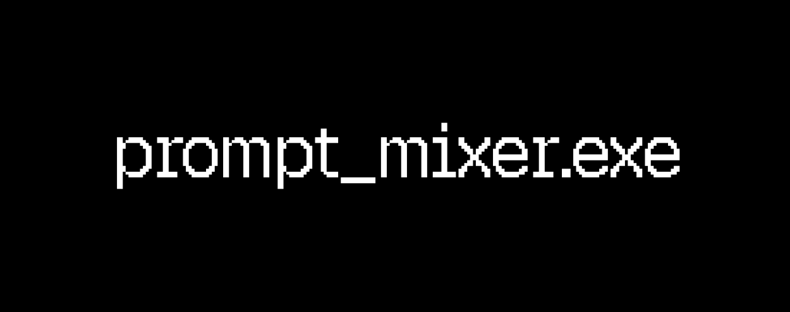
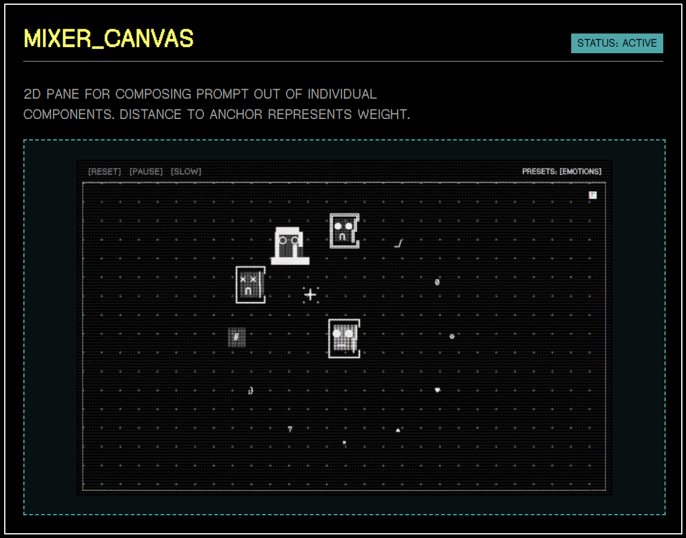
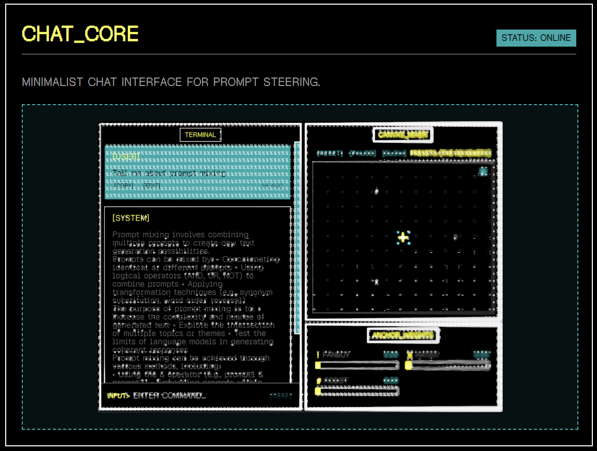
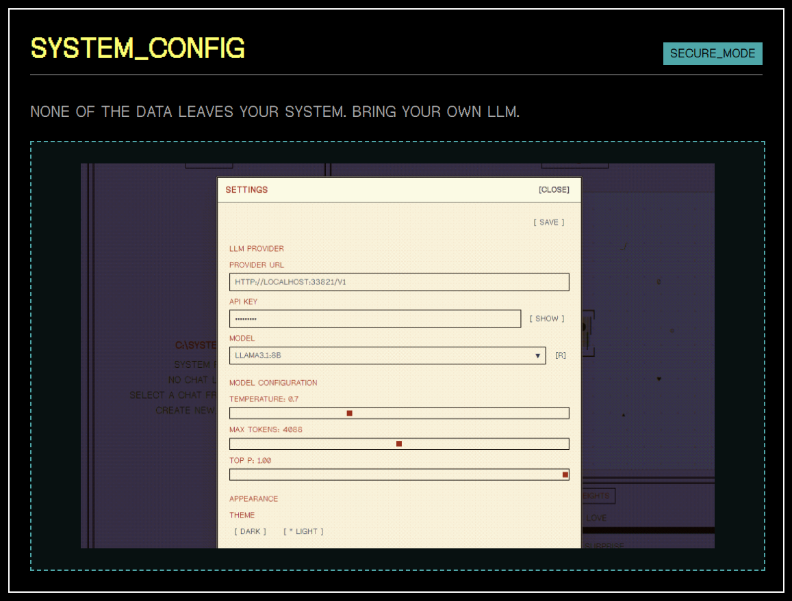

[](https://github.com/Jitera-Labs/prompt_mixer.exe)
[](https://github.com/Jitera-Labs/prompt_mixer.exe/commits/main)
[](https://github.com/Jitera-Labs/prompt_mixer.exe/blob/main/LICENSE)
[](https://visitorbadge.io/status?path=https%3A%2F%2Fgithub.com%2FJitera-Labs%2Fprompt_mixer.exe)

---

An environment to explore mid-generation prompt steering.

## [DEMO]


https://github.com/user-attachments/assets/1437dcbc-2d8c-4121-9cc4-c34dc677b075


## [FEATURES]



A canvas to mix individual components of the prompt together. Each component is represented as an anchor. Drag and drop to position them. Distance to the center represents weight in the resulting mix.



Minimalistic chat interface to interact with the model. Regen, edit messages. Pause and resume generation, slow it down for better control.



Point to any OpenAI-compatible endpoint with your API key. All data is stored locally in an encrypted vault.

## [INITIATION_SEQUENCE]

```bash
# INSTALL_DEPENDENCIES
npm install

# EXECUTE_PROGRAM
npm run tauri dev
```
